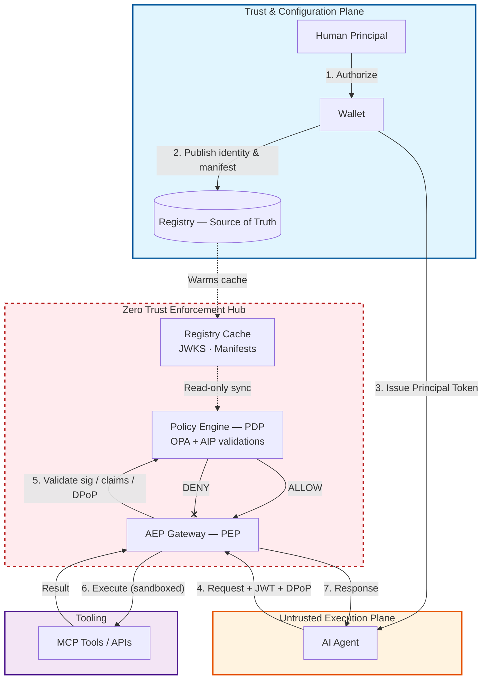
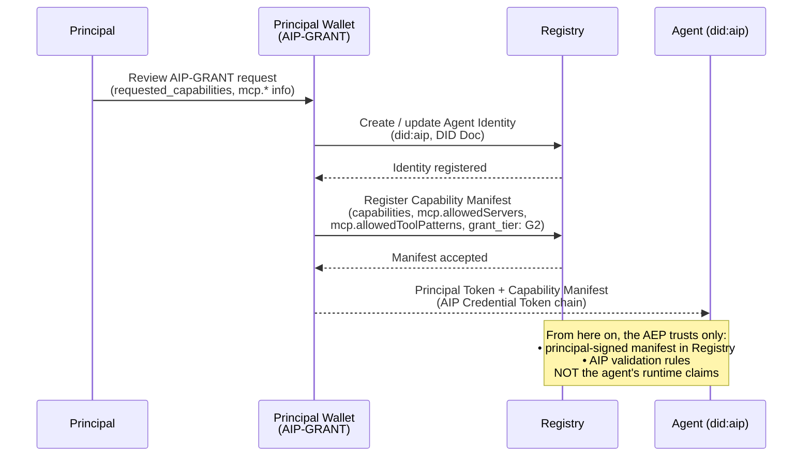
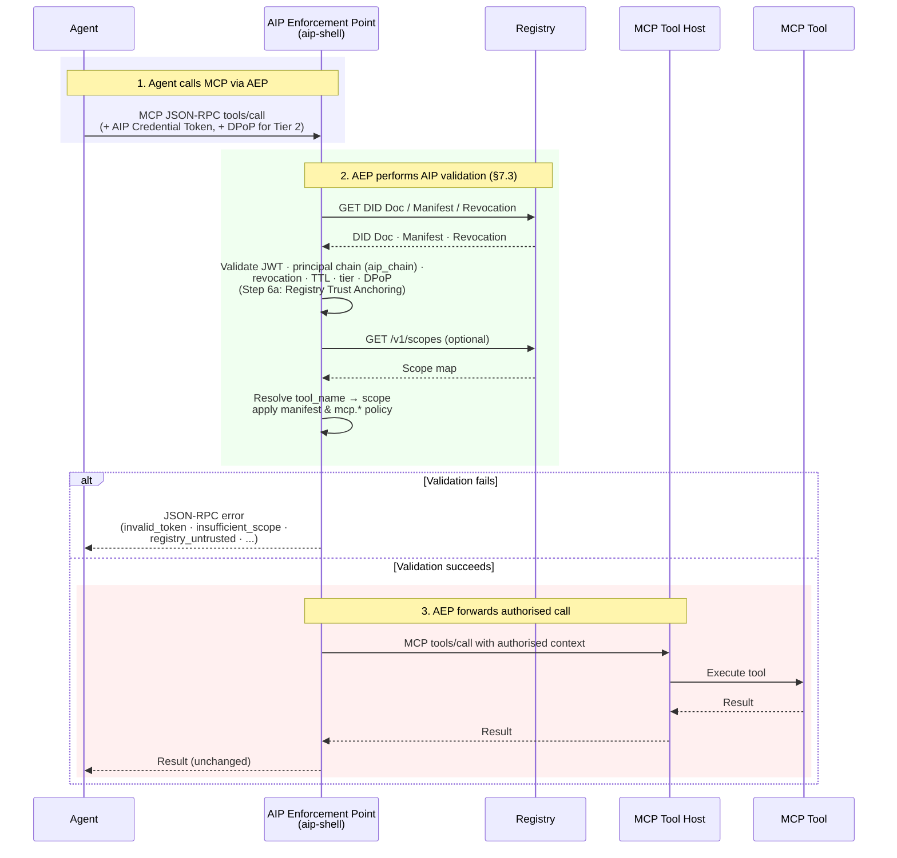
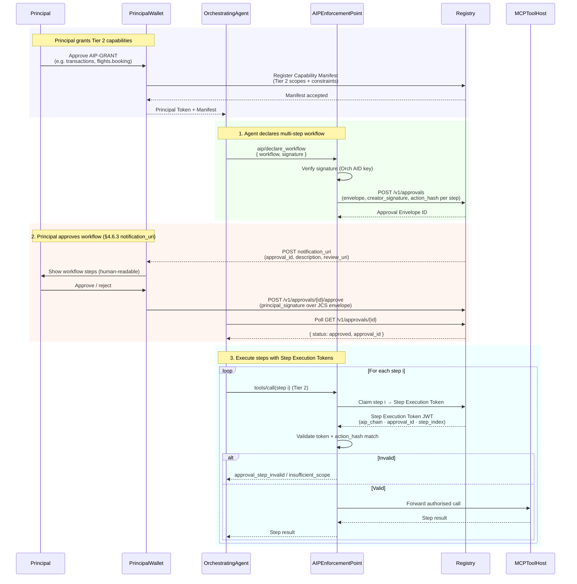

# AIP — Agent Identity Protocol

> The open standard for verifiable AI agent identity.

[](https://github.com/provai-dev/aip-spec)
[](spec/v0.3/aip-spec.md)
[](LICENSE)
[](https://www.w3.org/TR/did-core/)
[](https://www.rfc-editor.org/rfc/rfc2119)

---

## The Problem

AI agents are already sending emails, moving money, booking flights, and
spawning sub-agents — autonomously, on a human's behalf. When one of those
agents knocks on an API, a database, or another agent, there is no common
way to answer the four questions that matter:

1. **Who authorised this agent?** A specific human, a service, or nobody?
2. **What is it allowed to do?** Read only? Spend up to €500? Book flights
   in economy but not first?
3. **Is the grant still valid?** Has the human revoked it? Has the agent's
   key been rotated or compromised?
4. **Can I trust its track record?** What has this agent done before, and
   who vouches for it?

Today each vendor invents its own answer. The result is a sprawl of
incompatible API keys, opaque service accounts, and ad-hoc permission flags
— none of which survive cross-vendor delegation, sub-agent spawning, or
real-time revocation.

## What AIP Is

AIP is a **layered identity protocol** that answers those four questions
uniformly, across vendors, models, and runtimes. It defines:

| Layer | Primitive | Purpose |
|---|---|---|
| 1 | **Agent Identity (AID)** | A W3C DID (`did:aip`) that uniquely names an agent |
| 2 | **Principal Chain** | Cryptographic proof of the authorising human/org and every delegation step |
| 3 | **Capability Manifest** | Fine-grained, principal-signed scopes — what the agent may do |
| 4 | **Credential Token** | Short-lived signed JWT validated by the deterministic validation algorithm (§7.3) |
| 5 | **Revocation** | Kill switch that propagates to every relying party |
| 6 | **Reputation** | Endorsement data for trust accumulation across engagements |

Two implementations conforming to this specification interoperate without
coordination. See [CHARTER.md](CHARTER.md) for the full mission and scope.

---

## Before vs. After AIP

Most agent stacks today look like the top of the diagram: a human hands
an agent an API key or OAuth token, and that token is now indistinguishable
from the human's own access. Any tool the agent touches must trust the
agent's self-declared identity and cannot tell a sub-agent from its parent
or a revoked agent from a live one.

AIP re-anchors trust in the **principal's signature**, verified
independently by a Relying Party (or an AIP Enforcement Point acting on
its behalf) against a Registry the principal — not the agent — declares.

```mermaid
flowchart TB
    classDef bad fill:#ffe0e0,stroke:#b71c1c,stroke-width:2px
    classDef ok fill:#e0f2e7,stroke:#1b5e20,stroke-width:2px
    classDef infra fill:#eceff1,stroke:#37474f,stroke-width:1px

    subgraph Before ["❌ Without AIP — ambient trust"]
        H1[Human]-->|"API key / OAuth token"|A1[Agent]
        A1-->|"bearer token<br/>(who signed it?)"|T1[Tool / API]
        A1-->|"re-uses same token"|SA1[Sub-agent]
        SA1-->|"same bearer token<br/>(scope unclear)"|T1
        T1-.->|"cannot tell:<br/>• principal identity<br/>• current scope<br/>• revocation state<br/>• parent vs sub-agent"|X[❓]
    end
    class Before bad

    subgraph After ["✅ With AIP — verifiable delegation"]
        H2[Human Principal]-->|"1. signs AIP-GRANT<br/>in Wallet"|W2[Principal Wallet]
        W2-->|"2. registers DID Doc<br/>+ Capability Manifest"|R2[(AIP Registry)]
        W2-->|"3. issues<br/>Principal Token"|A2[Agent<br/>did:aip:...]
        A2-->|"4. mints Credential Token<br/>(short TTL, DPoP-bound,<br/>delegation chain attached)"|AEP2[Relying Party<br/>/ AEP Gateway]
        AEP2-->|"5. independent verify:<br/>signature · principal chain ·<br/>manifest · revocation · tier"|R2
        AEP2-->|"6. allow / deny"|T2[Tool / API]
        A2-->|"spawn_agents.create<br/>(Tier 2, DPoP, 300s TTL)"|SA2[Sub-agent<br/>did:aip:...]
        SA2-->|"narrowed scope<br/>(D-1 through D-5)"|AEP2
    end
    class After ok
    class R2,AEP2,T2 infra
```



Key guarantees the bottom half gives you that the top half does not:

- **Independent verifiability.** The Relying Party resolves the principal's
  DID Document itself and finds the authoritative Registry there
  (§6.2, §7.3 Step 6a — "Registry Trust Anchoring"). A compromised agent
  cannot redirect verifiers to a rogue Registry.
- **Attenuation-only delegation.** A sub-agent's scope is always a subset
  of its parent's (delegation rules D-1 through D-5, §8.2). No agent can
  grant more than it holds.
- **Real-time revocation for Tier 2.** Sensitive scopes
  (`transactions.*`, `communicate.*`, `filesystem.execute`,
  `spawn_agents.create`/`.manage`) require a live Registry check on every
  request and MUST NOT use cached revocation state (§9.3, AIP-0002).
- **Threat-model-aware Tiers.** Tier 1 = bounded-staleness. Tier 2 =
  real-time revocation + DPoP. Tier 3 = enterprise/regulated (adds mTLS
  and OCSP). Each Tier is an explicit declaration, not a label.

---

## Architecture at a Glance

The AIP ecosystem has four domains and a small number of well-defined
interactions between them:

```mermaid
flowchart LR
    subgraph PrincipalDomain["Principal side"]
        Principal["Human Principal"]
        Wallet["Principal Wallet<br/>(AIP-GRANT)"]
    end

    subgraph AgentDomain["Agent ecosystem"]
        Agent["AI Agent<br/>(did:aip)"]
    end

    subgraph AEPDomain["AEP & MCP layer"]
        AEP["AIP Enforcement Point<br/>(aip-shell)"]
        MCPServer["MCP Tool Host"]
        Tools["Tools / Data Sources"]
    end

    subgraph RegistryDomain["AIP Registry"]
        Registry["Registry<br/>DID Docs · Capability<br/>Manifests · Revocation ·<br/>Approval Envelopes ·<br/>/v1/scopes · Overlays ·<br/>Engagements · RPNP"]
    end

    Principal -->|"reviews & approves<br/>AIP-GRANT requests"| Wallet
    Wallet -->|"registers Agent Identity<br/>(did:aip, DID Doc)"| Registry
    Wallet -->|"registers Capability Manifest<br/>(scopes + mcp.*)"| Registry
    Registry -.->|"principal-signed state<br/>available via DID resolution"| Agent
    Agent -->|"resolve own DID & capabilities"| Registry
    Agent -->|"MCP JSON-RPC<br/>(HTTP / stdio)"| AEP
    AEP <-->|"fetch DID Doc · Manifest ·<br/>Revocation · /v1/scopes ·<br/>Approval Envelopes"| Registry
    AEP -->|"authorised MCP calls"| MCPServer
    MCPServer -->|"tool invocations"| Tools

    classDef trust fill:#eef,stroke:#333,stroke-width:1px;
    class PrincipalDomain,AgentDomain,AEPDomain,RegistryDomain trust;
```



- **Principal domain** — humans and their Wallets. The Wallet is the only
  component that can mint Principal Tokens.
- **Agent domain** — the agent and any orchestrators it runs. Agents hold
  their own signing key and mint their own short-lived Credential Tokens.
- **AEP layer** — the AIP Enforcement Point is the Relying Party's gate.
  It executes the validation algorithm (§7.3), applies policy
  against the live Capability Manifest, and forwards only authorised
  calls to the MCP tool host.
- **Registry** — the source of truth for DID documents, capability state,
  revocation, Approval Envelopes, Capability Overlays, Engagement Objects,
  and (in v0.3) push notifications via RPNP (§9.4).

### Zero-Trust Enforcement

AIP maps cleanly onto NIST SP 800-207 Zero Trust roles:



The AEP is the Policy Enforcement Point; the Policy Engine (typically OPA
plus the AIP validation algorithm) is the Policy Decision Point; the
Registry is the authoritative state store. The agent itself sits in the
untrusted execution plane — the AEP never trusts its runtime claims, only
principal-signed material resolved from the Registry.

---

## Key Flows

### 1. Principal grants capability to an agent (G2 — Direct Deployer flow)



v0.3 offers three grant tiers (AIP-0005):

- **G1 — Registry-Mediated.** Consumer flows; the Registry brokers consent.
- **G2 — Direct Deployer.** Enterprise self-service; current v0.2 flow.
- **G3 — Full Ceremony.** OAuth 2.1 + PKCE + identity proofing
  (`acr`/`amr`). Required for Tier 3 deployments.

### 2. Agent invokes an MCP tool through the AEP



### 3. Multi-step Tier 2 workflow with Approval Envelopes

For workflows that cross TTL boundaries or span multiple sensitive steps,
the orchestrator declares the whole plan up front; the principal approves
it once; the Registry issues a **Step Execution Token** per step at
execution time (§4.6).



The Approval Envelope is the solution to two specific v0.2 pain points,
both documented in §4.6: the **cascading-approval problem** (one human
click per step is unworkable for real workflows) and the
**token-expiry-while-pending problem** (Tier 2 TTL ≤ 300s is shorter than
many approval round-trips).

---

## The v0.3 Feature Set

v0.3 is a working draft integrating 16 AIPs. Highlights:

| Area | Addition | AIP |
|---|---|---|
| **Threat-model Tiers** | Tier 1/2/3 reframed as explicit declarations; `spawn_agents` split into `.create`/`.manage`, both Tier 2 | [0002](proposals/0002-tier-threat-model/proposal.md), [0003](proposals/0003-spawn-agents-tier2/proposal.md) |
| **Grant tiers** | G1/G2/G3 grant model; OAuth 2.1 AS at the Registry; `acr`/`amr` on Principal Tokens | [0005](proposals/0005-three-tier-grant-model/proposal.md) |
| **Registry Trust Anchoring** | `AIPRegistry` service entry in the principal's DID Document; new Step 6a in §7.3 | [0006](proposals/0006-registry-trust-anchoring/proposal.md) |
| **Capability Overlays** | Context-specific attenuation (Rule CO-1: never expands); new Step 9e | [0007](proposals/0007-capability-overlays/proposal.md) |
| **Engagement Objects** | Multi-party, append-only change log; approval gates; Step 6b | [0008](proposals/0008-engagement-objects/proposal.md) |
| **RPNP** | Registry Push Notification Protocol — 5-second delivery SLA for revocation events | [0009](proposals/0009-rpnp/proposal.md) |
| **Token Exchange for MCP** | RFC 8693 exchange with DPoP binding and scope attenuation (§7.5) | [0010](proposals/0010-token-exchange-mcp/proposal.md) |
| **Scope Map** | `urn:aip:scope:` URI namespace; `GET /v1/scopes` | [0011](proposals/0011-scope-map/proposal.md) |
| **MCP integration note** | Informative framing of AIP ↔ MCP boundary (§1.2) | [0013](proposals/0013-mcp-integration-note/proposal.md) |

See [AIP_INDEX.md](AIP_INDEX.md) for the full list and
[`spec/v0.3/aip-spec.md` Appendix B](spec/v0.3/aip-spec.md) for the
complete v0.2 → v0.3 changelog.

---

## How to Read the Spec

Every spec version lives under its own directory in [`spec/`](spec/). The
most recent released version is the authoritative reference; the
highest-numbered draft is the working copy.

1. **Start here:** [`spec/v0.3/aip-spec.md`](spec/v0.3/aip-spec.md) — the
   current working draft. All normative requirements, schemas, and
   algorithms are in this file.
2. **Most recent released version:** [`spec/v0.2/aip-spec.md`](spec/v0.2/aip-spec.md)
   — immutable. Implementations pinning to a stable version should use this.
3. **Architecture background:** §§ 1–3 cover motivation, design philosophy,
   Tiers as threat-model declarations, and terminology.
4. **For implementers:** §§ 4–12 define the normative primitives.
   §§ 13–16 cover error handling, rate limiting, Registry interface, and
   versioning.
5. **Security:** § 17 is the threat model. § 17.1 enumerates threat
   scenarios TS-1 through TS-14 and their mitigations.
6. **Schemas:** [`spec/v0.3/schemas/`](spec/v0.3/schemas/) — JSON Schemas
   for every AIP data structure.
7. **Examples:** [`spec/v0.3/examples/`](spec/v0.3/examples/) — annotated
   example JSON for common scenarios.

> **Note:** Prior to AIP-0001 the spec lived at `docs/aip-spec.md` with
> schemas at `schemas/latest/` and examples at `examples/latest/`. A
> non-normative stub remains at [`docs/aip-spec.md`](docs/aip-spec.md) for
> external inbound-link compatibility; all authoritative content has moved
> under `spec/vMAJOR.MINOR/`.

---

## Quick Example

```javascript
// npm install @provai/aip

import { aip } from '@provai/aip'

// Create a W3C DID-conformant Agent Identity
const agent = await aip.createAgent({
  name: 'Jarvis',
  type: 'personal',
  model: 'claude-sonnet-4-6',
  principal: 'did:web:alice.example.com'
})

console.log(agent.aid)
// → "did:aip:personal:9f3a1c82b4e6d7f0a2b5c8e1d4f7a0b3"

// Sign a Credential Token
const token = await agent.sign({
  purpose: 'email.read',
  expires_in: '1h'
})

// Verify at any relying party (executes §7.3 validation algorithm)
const result = await aip.verify(token)
// → { valid: true, aid: "did:aip:...", scope: ['email.read'], tier: 1, ... }
```

---

## Conformance

An implementation is AIP-conformant (against a specific `spec/vMAJOR.MINOR/`
version) if it:

1. Generates Agent IDs conforming to the `did:aip` DID method syntax
   defined in that version's `aip-spec.md` § 4.1.
2. Issues and verifies Credential Tokens according to the validation
   algorithm in § 7.3 (Steps 1–12, with conditional sub-steps 6a, 6b,
   9e, and 10a added in v0.3).
3. Implements the mandatory-to-implement (MTI) cryptographic suites in
   § 17.2.
4. Enforces Capability Manifest scope intersection during delegation as
   defined in § 8.2 (Rules D-1 through D-5).
5. For Tier 2 conformance: enforces real-time revocation, DPoP, and
   Registry Trust Anchoring (Step 6a).
6. For Tier 3 conformance: additionally enforces mTLS and OCSP (§ 16.1
   conformance table).

A conformance test suite is planned for v0.4.

---

## Repository Structure

```
aip-spec/
│
├── spec/                       ← Versioned specification directories
│   ├── v0.2/                   ← Released v0.2 (immutable)
│   │   ├── aip-spec.md
│   │   ├── schemas/
│   │   └── examples/
│   └── v0.3/                   ← Current working draft (mutable until release)
│       ├── aip-spec.md
│       ├── schemas/
│       └── examples/
│
├── docs/
│   ├── aip-spec.md             ← Non-normative redirect stub
│   └── archive/                ← Pre-editorial historical files
│
├── proposals/                  ← AIP proposals (community-driven changes)
│   ├── 0001-repo-layout-versioning/
│   ├── 0002-tier-threat-model/
│   ├── ...
│   └── _template/              ← Template for new proposals
│
├── CHARTER.md                  ← Mission, scope, IP policy
├── GOVERNANCE.md               ← Roles, lifecycle, decision-making
├── EDITORS.md                  ← Current Editor and Reviewer roster
├── CONTRIBUTING.md             ← How to contribute
├── CODE_OF_CONDUCT.md          ← Community standards
├── SECURITY.md                 ← Responsible disclosure policy
├── VERSIONING.md               ← Versioning policy
├── AIP_INDEX.md                ← Auto-generated index of all proposals
└── LICENSE                     ← CC0 1.0 Universal
```

---

## Status and Roadmap

| Document | Version | Status |
|----------|---------|--------|
| [AIP Specification v0.2](spec/v0.2/aip-spec.md) | v0.2 | Standards Track — Draft (frozen) |
| [AIP Specification v0.3](spec/v0.3/aip-spec.md) | v0.3 | Standards Track — Draft (working) |

**Current working draft:** v0.3. Integrates the v0.2 → v0.3 normative
change batch (grant-tier model, Registry Trust Anchoring, Capability
Overlays, Engagement Objects, RPNP, Token Exchange for MCP). See
[`AIP_INDEX.md`](AIP_INDEX.md) and Appendix B of the v0.3 spec.

**v0.4 targets:** Conformance test suite, formal `did:aip` method
registration with W3C, and at least one reference implementation exercised
against the suite.

**v1.0 criteria:** Two independent conforming implementations, published
conformance test suite, and super-majority Editor vote declaring the spec
stable.

See [AIP_INDEX.md](AIP_INDEX.md) for active proposals and
[VERSIONING.md](VERSIONING.md) for the full versioning policy.

---

## Relationship to Existing Standards

AIP builds on existing standards rather than replacing them:

| Standard | Relationship |
|----------|-------------|
| [W3C DID v1.1](https://www.w3.org/TR/did-core/) | AIP's `did:aip` is a conformant DID method |
| [RFC 7519 — JWT](https://www.rfc-editor.org/rfc/rfc7519) | Credential Tokens are JWTs with AIP-defined claims |
| [RFC 9449 — OAuth DPoP](https://www.rfc-editor.org/rfc/rfc9449) | Proof-of-Possession on Tier 2+ requests |
| [RFC 8693 — Token Exchange](https://www.rfc-editor.org/rfc/rfc8693) | AIP → MCP access-token exchange (§7.5) |
| [RFC 7636 — PKCE](https://www.rfc-editor.org/rfc/rfc7636) | G3 authorization flow |
| [RFC 8414 — AS Metadata](https://www.rfc-editor.org/rfc/rfc8414) | G3 Registry-as-OAuth-AS discovery |
| [RFC 8785 — JCS](https://www.rfc-editor.org/rfc/rfc8785) | Canonical JSON for `action_hash` and signatures |
| [NIST SP 800-207](https://doi.org/10.6028/NIST.SP.800-207) | AIP implements Zero Trust Architecture principles |
| [SPIFFE/SPIRE](https://spiffe.io/) | Complementary — SPIFFE for service workloads, AIP for reasoning agents |
| [MCP](https://modelcontextprotocol.io/specification) | AIP is the agent identity layer beneath MCP's authorisation flow |

---

## How to Contribute

AIP is a community-governed open standard. All are welcome.

- **Quick fix** (typo, broken link): submit a PR with title `[EDITORIAL] ...`
- **Found a spec bug**: open an [Errata issue](.github/ISSUE_TEMPLATE/errata.yaml)
- **New idea for the spec**: open a [New Proposal issue](.github/ISSUE_TEMPLATE/new-proposal.yaml)
- **Questions**: [GitHub Discussions](https://github.com/provai-dev/aip-spec/discussions)
  or [Discord](https://discord.gg/FpeHxaKV)
- **Security vulnerability**: see [SECURITY.md](SECURITY.md) — private disclosure only

Read [CONTRIBUTING.md](CONTRIBUTING.md) for the full process, including the
DCO sign-off requirement.

---

## Governance

AIP is governed by a body of Editors listed in [EDITORS.md](EDITORS.md). The
governance model — roles, proposal lifecycle, decision-making, and conflict
resolution — is defined in [GOVERNANCE.md](GOVERNANCE.md).

AIP was founded by [Provai](https://provai.dev). The specification is owned
by the community. Provai provides engineering resources and initial
governance leadership and intends to transition to a neutral foundation
structure as the specification matures. See
[CHARTER.md § 5](CHARTER.md#5-stewardship-and-transition) for the
transition plan.

---

## License

[CC0 1.0 Universal](LICENSE) — no rights reserved, implement freely.
